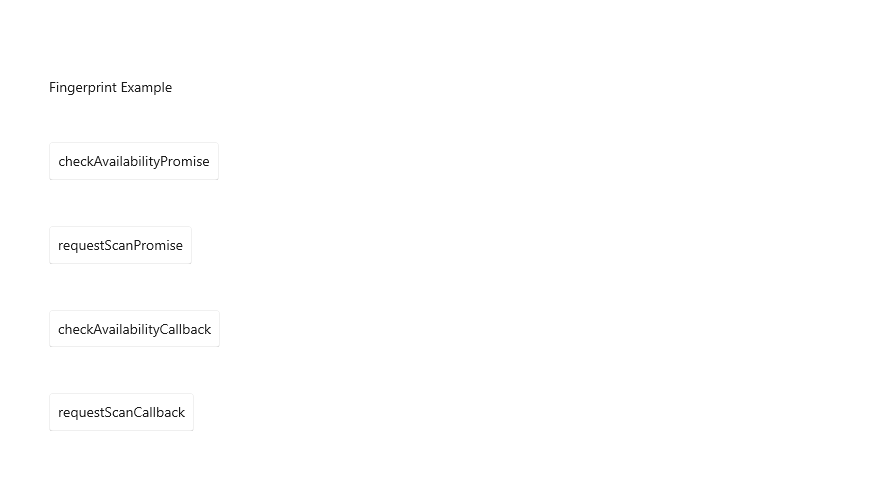

<p align="center">
  
</p>
<p align="center">
    React Native Windows library providing developers with all Windows Hello features.
</p>
<p align="center">
    <a href="https://www.npmjs.com/package/react-native-windows-hello">
        
    </a>
    <a href="https://app.circleci.com/pipelines/github/callstack-internal/react-native-windows-hello?branch=main">
        
    </a>
    <a href="https://github.com/callstack-internal/react-native-windows-hello/blob/main/LICENSE.md">
        
    </a>
</p>


<p align="center">
    The following library allows you to use all features of <a href="https://support.microsoft.com/en-us/windows/sign-in-to-your-microsoft-account-with-windows-hello-or-a-security-key-800a8c01-6b61-49f5-0660-c2159bea4d84#WindowsVersion=Windows_10">Windows Hello</a> functionality. This includes the signing-in options and passport.
    This library is a set of native methods providing easy API to fetch the device availability, sign in using your biometrics.
    
</p>

---

## Installation & Usage

To install this module `cd` to your project directory and enter the following command:
```
yarn add react-native-windows-hello
```
or
```
npm install react-native-windows-hello --save
```

After having it installed you can call all the Windows Hello methods through the `SignIn` class, so the usage would be:
```javascript
const signIn = new SignIn();
signIn.getConsentMessage()
  .then(result => {
    Alert.alert("SUCCESS", `${result}`);
  })
  .catch(error => {
    Alert.alert("ERROR:", `${error}`);
  });
```

Check out the [example project](example) for more examples.

---

## API

The following library provides you with the native modules exposing the following methods:

| Method | Description | Returns |
| ------ | - | - |
| `SignIn`<br/>`.checkAvailabilityPromise` | Gets the status of biometric device on a user's machine and returns a promise with the result | `Promise` with `String` |
| `SignIn`<br/>`.requestScanPromise` | Displays the biometric scan prompt as a popup and returns a promise after user's actions | `Promise` with `String` |
| `SignIn`<br/>`.checkAvailabilityCallback` | Gets the status of biometric device on a user's machine and launches a callback with the result as a callback's parameter | Callback(`String`) |
| `SignIn`<br/>`.requestScanCallback` | Displays the biometric scan prompt as a popup and returns a result through a callback | Callback(`String`) |
| `SignIn`<br/>`.checkAvailabilityAsync` | Gets the status of biometric device on a user's machine and returns an empty callback, which acts as a notification about launching the request. The result of that action should be then manually fetched by running `getLastAvailabilityCheckResult` | Callback() |
| `SignIn`<br/>`.requestScanAsync` | Displays the biometric scan prompt as a popup and returns an empty callback after user's actions, which acts as a notification about launching the request. The result of that action should be then manually fetched by running `getLastScanResult` | Callback() |
| `SignIn`<br/>`.getLastScanResult` | Returns a promise with last result of a biometric device status | `Promise` with `String` |
| `SignIn`<br/>`.getLastAvailabilityCheckResult` | Returns a promise with last result of a biometric signing in result | `Promise` with `String` |

---

## Contributing

If you would like to contribute to the *react-native-windows-hello* project, you are more than welcome!
You can do this by:
* Create an [Issue](https://github.com/callstack/react-native-windows-hello/issues/new) and let the author handle it
<br/>Each issue created in the [Issues section](https://github.com/callstack/react-native-windows-hello/issues) gives a chance of improving the project and make it even more useful.
* Create the [Pull Request](https://github.com/callstack/react-native-windows-hello/compare) with the desired changes
<br/>When creating the pull request please remember to describe changes you made and how to test them. A short demo of any kind is very appreciated.

### Setting up the project

To start developing you need to fork this project, and clone your fork.
<br/>After that you can:
* `yarn install`
* Implement changes (mostly in *windows/ReactNativeWindowsHello/Source* directory)
* After implementation you can check the build by running:
<br/>`msbuild -p:Configuration=Debug -p:Platform=x64 .\windows\ReactNativeWindowsHello.sln`
<br/>Or launch the build through the Visual Studio.

---

## Made with ❤️ at Callstack

`react-native-windows-hello` is an open source project and will always remain free to use. If you think it's cool, please star it 🌟. [Callstack](https://callstack.com/) is a group of React and React Native geeks, contact us at [hello@callstack.com](mailto:hello@callstack.com) if you need any help with these or just want to say hi!

Like the project? ⚛️ [Join the team](https://callstack.com/careers) who does amazing stuff for clients and drives React Native Open Source! 🔥
