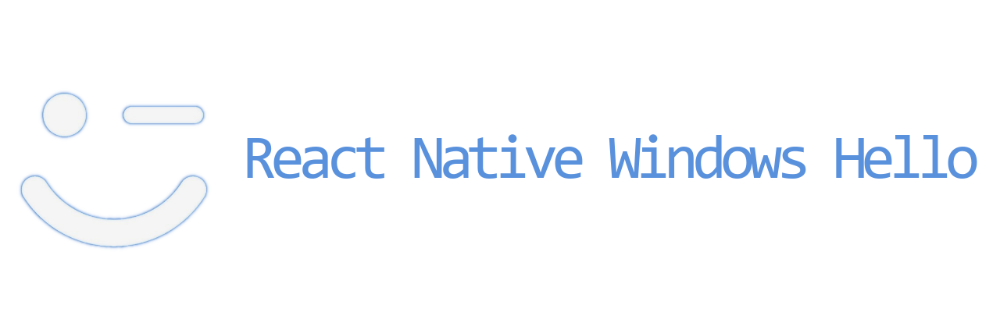

  

    React Native Windows library providing developers with all Windows Hello features.

    
    
    

---

## Made with ❤️ at Callstack

`react-native-windows-hello` is an open source project and will always remain free to use. If you think it's cool, please star it 🌟. [Callstack](https://callstack.com/) is a group of React and React Native geeks, contact us at [hello@callstack.com](mailto:hello@callstack.com) if you need any help with these or just want to say hi!

Like the project? ⚛️ [Join the team](https://callstack.com/careers) who does amazing stuff for clients and drives React Native Open Source! 🔥
